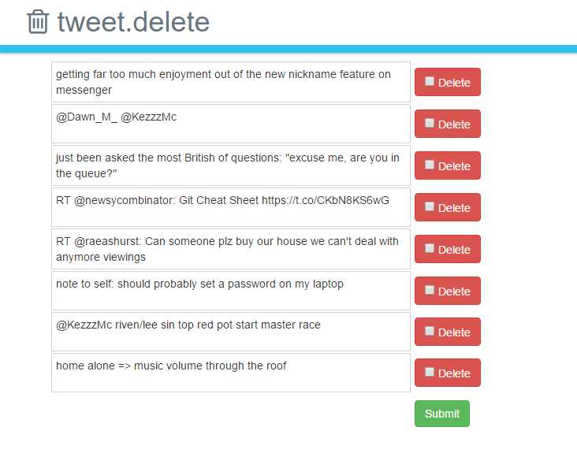

# tweet-delete
A tool to help clean up your twitter account, this app runs your tweets through sentiment analysis then suggests negative ones for deletion.

**Can be deployed to Heroku!** - just set the environment variables in .env.example.

Created in the wee hours of the morning at Hackference in October 2015

sources:
  * [Libary to keep api keys secret using environment variables](http://github.com/vlucas/phpdotenv)
  * [Library to authenticate with twitter](http://twitteroauth.com)
  * [Service to categorise tweets](http://help.sentiment140.com/api)
